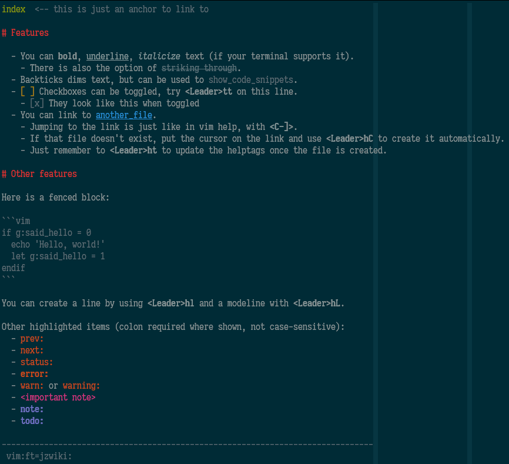

# jzwiki

jzwiki is a simple and opinionated help.vim-based "wiki" system for my personal rapid documentation use. Feel free to hack it up to suit your own needs.

See `:help jzwiki` for full documentation, or `:help jzwiki-syntax` for a quick overview of what is available.

## Example

This is what `examples/index.txt` looks like:

